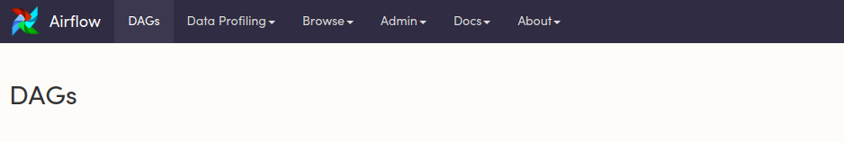
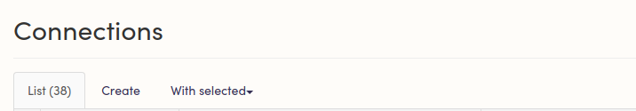
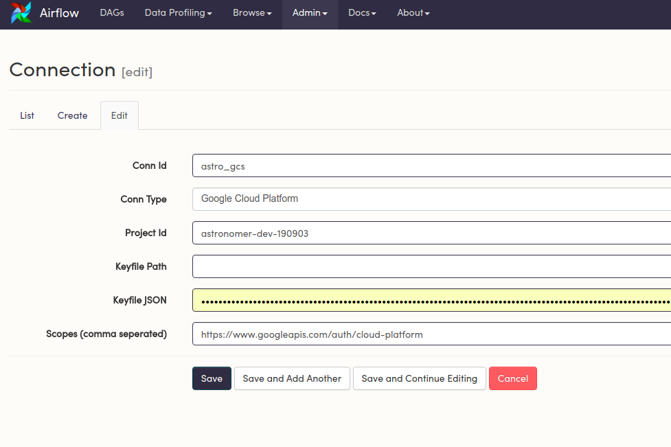
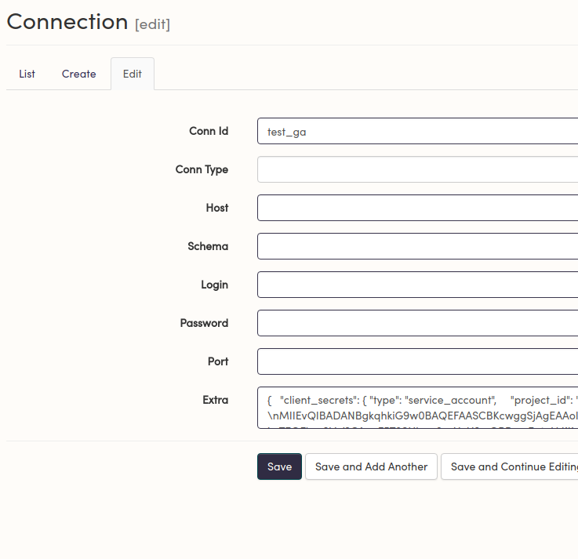

# Getting Started with GCP on Airflow

_Running Airflow with Python3 on Google Cloud._


Python3 and Google Cloud don't always play nicely together. Despite the availability of python3 (almost a decade), and the announced EOL (End of Life) date for python2 (2020) - some GoogleCloud APIs still don't have python3 support.

This can be problematic when installing Airflow with it's GCP dependencies using the [install command](https://airflow.apache.org/installation.html).


## The Issue
_Snakebite and ApacheBeam_

[Snakebite](http://snakebite.readthedocs.io/en/latest/) - a python package that provides support interacting with HDFS/hadoop does not have full python3 support. There is a [similar issue](https://beam.apache.org/get-started/quickstart-py/) with ApacheBeam, which only has python2 support for later versions.


## Workarounds


### Limited Imports
If you aren't using any services that rely on the aforementioned packages (Google Dataflow, Google DataProc), you can just add the individual packages to your project's `requirements.txt`.

For example, if your use case was moving data between Google Cloud Storage (GCS) and BigQuery, you only need the following packages:
```
httplib2
google-api-python-client>=1.5.0, <1.6.0
oauth2client>=2.0.2, <2.1.0
PyOpenSSL
pandas-gbq
google-cloud-storage==1.6.0
```

This should be everything you need to use `BigQueryOperator`, `BigQueryToCloudStorageOperator` and all related hooks/operators/sensors.

This will also help keep your list of installed packages slim.


### Virtual Environments
If your use case demands that you use some of these services, you can always run python2 in some sort of virtual environment.

#### DockerOperator
The `DockerOperator` allows you to execute a command inside a DockerContainer. You can wrap your python2 command into a docker image, and then run that image in a container from Airflow. 


The DockerOperator can also be used to execute arbitrary code in other languages. The attached `docker_operator_example.py` DAG shows how to execute a publicly hosted DockerImage. In the past, Astronomer would use a javascript library, Aries, to stream data into data lakes.

As long as the Docker Image contains all the necessary logic to execute a job, the Operator can simply call a bash command to start the task. The tricky part is making sure all necessary parameters are properly passed in.

**Note**: Astronomer no longer maintains the Aries Docker images. The attached is just an example of how we used to run them. 


#### PythonVirtualEnvOperator
A solution that involves fewer moving parts - the [PythonVirtualEnvOperator](https://github.com/apache/airflow/blob/main/airflow/operators/python.py) allows to run an arbitrary python function (with some caveats).

Define a python callable:
```python
def test_func_two():
    import sys
    print(sys.version)
```

And then call the **PythonVirtualEnvOperator:**

```python
t2 = PythonVirtualenvOperator(
    task_id='test_two',
    python_version='2',
    python_callable=test_func_two,
    dag=dag
)
```


The output confirms that the function is ran in python2:
```
 b'2.7.14 (default, Dec 14 2017, 15:51:29) \n[GCC 6.4.0]\nhi\n
```

This same pattern can be used to call run any code that interacts with `Snakebite` or `ApacheBeam`.

Note that to get this to run, python2 needs to exist in the box/container the task is executing in. 
If you are using Astronomer Enterprise, you can add the following to your project's `Dockerfile`:


```
RUN apk add py-virtualenv
```
We also recommend adding:
```
ENV AIRFLOW__CORE__DONOT_PICKLE True
ENV AIRFLOW__WEBSERVER__EXPOSE_CONFIG True
```


**Note:** If your virtualenv runs in a different Python major version than Airflow, you cannot use return values, op_args, or op_kwargs. You can use string_args though. The full list of caveats can be found [in the docs.](https://github.com/apache/incubator-airflow/blob/master/airflow/operators/python_operator.py#L174)

## Sample Workflow
### Google Analytics to Google Cloud Storage.

*This walksthrough the code found in `example_code`*

To move data from Google Analytics into Google Cloud Storage, you'll need:

- A service account JSON key with the right privileges for GCS and BigQuery(recommend Admin access).

- A Google Analytics Airflow plugin. This guide is written to work with the one attached.

#### Enter your credentials:
Navigate to the **`Connections`** tab:


Create a new Google Cloud Connection:



and enter the corresponding information:


**Note**: Since Astronomer Airflow uses a distributed set-up, it is best to entire the keyfile as a JSON object. Be sure to specify the project id (even though it is found in the JSON key) and the scopes associated with the project (https://www.googleapis.com/auth/cloud-platform) is the default.


Do the same thing with your Google Analytics key, but pick a blank `Connection Type` and enter your key in a `client_secrets` object in the `Extras`:




```python
{"client_secrets" :{"YOUR KEY HERE"}}
```

#### Verify Connections.
Run the attached `gcs_to_bq_test.py` DAG to verify that you can connect to Google Cloud Platform. Running this DAG  successfully will your service accounts have the right access to move data from Google Cloud Storage into Google Big Query.

#### Write the DAG:
Now that the connections are all taken care of, the DAG file can resemble a config file. If you are new to Airflow, please see [this guide](https://www.astronomer.io/guides/managing-dependencies/) for an overview on managing dependencies.

The DAG in the attached `google_analytics_to_gcs.py` takes two different Google Analytics queries and puts the corresponding results in separate files for every time period they are run. This keeps the workflow idempotent and maintains a 1:1 relationship between each DagRun and each intermediary file. 
