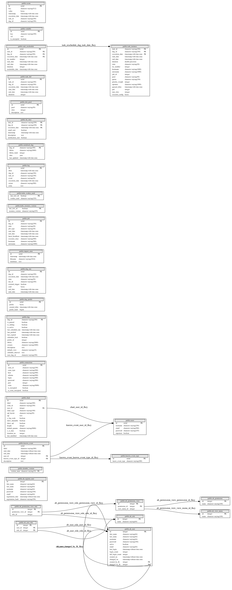

# Understanding the Airflow Metadata Database
## Overview

> Note: This guide has been updated with Airflow Airflow 1.10.10. New tables may be introduced in newer versions. 

A question we often get asked about here at Astronomer is regarding the structure of the underlying Airflow metadata database. The Airflow metadata database stores configurations, such as variables and connections. It also stores user information, roles, and policies and is the Airflow Scheduler's source of truths when it comes to the metadata regarding DAGs, schedule intervals, statistics from each run, and their tasks. 

Airflow uses SQLAlchemy and Object Relational Mapping (ORM) in Python to connect and interact with the underlying metadata database from the application layer. Thus, any database supported by SQLALchemy can be configured to store all the metadata. On Astronomer, each Airflow deployment is equiped with PostgreSQL database for this purpose. The following guide details all the tables available in the database repository including dependencies and the complete ERD diagram. 

Even though we don't recommend modifying the values directly on the database as it might affect dependencies, understanding the underlying structure can be very useful when it comes to building your own reports or queries directly the database. You can find some useful queries that go directly against these tables in our [Useful SQL queries for Apache Airflow](#https://www.astronomer.io/guides/airflow-queries/) guide. 

## ERD Diagram
The following diagram displays all the tables from the aiflow 
Further descriptions and structure for each table is 

------------------------------------------------------------------------

## Tables

The Airflow metadata database has a total of 30 tables  tables are stored on the public schema by default. The following describe the table structure and reference for the airflow metadata tables. 

### public.ab_permission
**Description:** 

**Table Structure:**
|  F-Key   |Name   |Type                     |Description|
|:-------  |:------ |:-----------------------|:-----------|
|          |id     |integer                  |*PRIMARY KEY*|
|          |name   |character varying(100)   |*UNIQUE NOT NULL*|

**Tables referencing this one via Foreign Key Constraints:**

-   [public.ab_permission_view](#public.ab\_permission\_view)

------------------------------------------------------------------------

### public.ab_permission_view

**Description:** 

**Table Structure:**
|F-Key                                                 |Name            |Type      |Description   |
|:-----------------------------------------------------|:---------------|:---------|:-------------|
|                                                      |id              |integer   |*PRIMARY KEY*|
|  [public.ab_permission.id](#public.ab\_permission)   |permission_id   |integer   |*UNIQUE\#1*|
|  [public.ab_view_menu.id](#public.ab\_view\_menu)    |view_menu_id    |integer   |*UNIQUE\#1*|

**Tables referencing this one via Foreign Key Constraints:**

-   [public.ab_permission_view_role](#public.ab\_permission\_view\_role)

------------------------------------------------------------------------

###  public.ab_permission_view_role

**Description:** 

**Table Structure:**
|F-Key  |Name |Type |Description|
|:------|:----|:----|:----------|
|       |id   |integer |   *PRIMARY KEY*|
|[public.ab_permission_view.id](#public.ab\_permission\_view)   |permission_view_id   |integer   |*UNIQUE\#1*|
|[public.ab_role.id](#public.ab\_role)                         |role_id              |integer   |*UNIQUE\#1*|

------------------------------------------------------------------------

###  public.ab_register_user

**Description:** 

**Table Structure:**
|  F-Key  |Name                |Type                          |Description|
|:------- |:-------------------|:-----------------------------|:------------------|
||          id                  |integer                       |*PRIMARY KEY*
||          first_name          |character varying(64)         |*NOT NULL*
||          last_name           |character varying(64)         |*NOT NULL*
||          username            |character varying(64)         |*UNIQUE NOT NULL*
||          password            |character varying(256)        |
||          email               |character varying(64)         |*NOT NULL*
||          registration_date   |timestamp without time zone   |
||          registration_hash   |character varying(256)        |

------------------------------------------------------------------------

###  public.ab_role

**Description:** 

**Table Structure:**
|F-Key     |Name   |Type                    |Description|
|:-------  |:------|:-----------------------|:-------------------|
|          |id     |integer                 |*PRIMARY KEY*|
|          |name   |character varying(64)   |*UNIQUE NOT NULL*|

**Tables referencing this one via Foreign Key Constraints:**
-   [public.ab_permission_view_role](#public.ab-permission\_view\_role)
-   [public.ab_user_role](#public.ab\_user\_role)

------------------------------------------------------------------------

###  public.ab_user
**Description:** 

**Table Structure:**
|F-Key                                        |Name                 |Type                          |Description
|:--------------------------------------------|:--------------------|:-----------------------------|:-------------------
|                                             |  id                 |integer                       |*PRIMARY KEY*
|                                             |  first_name         |character varying(64)         |*NOT NULL*
|                                             |  last_name          |character varying(64)         |*NOT NULL*
|                                             |  username           |character varying(64)         |*UNIQUE NOT NULL*
|                                             |  password           |character varying(256)        |
|                                             |  active             |boolean                       |
|                                             |  email              |character varying(64)         |*UNIQUE NOT NULL*
|                                             |  last_login         |timestamp without time zone   |
|                                             |  login_count        |integer                       |
|                                             |  fail_login_count   |integer                       |
|                                             |  created_on         |timestamp without time zone   |
|                                             |  changed_on         |timestamp without time zone   |
|  [public.ab_user.id](#public.ab\_user) |  created_by_fk      |integer                       |
|  [public.ab_user.id](#public.ab\_user) |  changed_by_fk      |integer                       |

**Tables referencing this one via Foreign Key Constraints:**
-   [public.ab_user](#public.ab\_user)
-   [public.ab_user_role](#public.ab\_user\_role)
------------------------------------------------------------------------

###  public.ab_user_role
**Description:** 

**Table Structure:**
|F-Key                                        |Name      |Type      |Description
|:------------------------------------------- |:-------- |:-------- |:--------------
|                                             |id        |integer   |*PRIMARY KEY*
|[public.ab_user.id](#public.ab\_user)   |user_id   |integer   |*UNIQUE\#1*
|[public.ab_role.id](#public.ab\_role)   |role_id   |integer   |*UNIQUE\#1*

------------------------------------------------------------------------

###  public.ab_view_menu
**Description:** 

**Table Structure:**
|F-Key   |Name   |Type                     |Description
|:------ |:----- |:----------------------- |:-------------------
|        |id     |integer                  |*PRIMARY KEY*
|        |name   |character varying(100)   |*UNIQUE NOT NULL*

**Tables referencing this one via Foreign Key Constraints:**
-   [public.ab_permission_view](#public.ab\_permission\_view)

------------------------------------------------------------------------

###  public.alembic_version
**Description:** 

**Table Structure:**
|F-Key   |Name          |Type                    |Description
|------- |:------------ |:---------------------- |:--------------
|        |version_num   |character varying(32)   |*PRIMARY KEY*

------------------------------------------------------------------------

###  public.chart
**Description:** 

**Table Structure:**
|F-Key                                    |Name              |Type                       |Description
|---------------------------------------- |:---------------- |:------------------------- |:--------------
|                                         |id                |serial                     |*PRIMARY KEY*
|                                         |label             |character varying(200)     |
|                                         |conn_id           |character varying(250)     |*NOT NULL*
|[public.users.id](#public.users)   |user_id           |integer                    |
|                                         |chart_type        |character varying(100)     |
|                                         |sql_layout        |character varying(50)      |
|                                         |sql               |text                       |
|                                         |y_log_scale       |boolean                    |
|                                         |show_datatable    |boolean                    |
|                                         |show_sql          |boolean                    |
|                                         |height            |integer                    |
|                                         |default_params    |character varying(5000)    |
|                                         |x_is_date         |boolean                    |
|                                         |iteration_no      |integer                    |
|                                         |last_modified     |timestamp with time zone   |

------------------------------------------------------------------------

###  public.connection
**Description:** 

**Table Structure:**
|F-Key   |Name                 |Type                      |Description
|:------ |:------------------- |:------------------------ |:--------------
|        |id                   |serial                    |*PRIMARY KEY*
|        |conn_id              |character varying(250)    |
|        |conn_type            |character varying(500)    |
|        |host                 |character varying(500)    |
|        |schema               |character varying(500)    |
|        |login                |character varying(500)    |
|        |password             |character varying(500)    |
|        |port                 |integer                   |
|        |extra                |character varying(5000)   |
|        |is_encrypted         |boolean                   |
|        |is_extra_encrypted   |boolean                   |

------------------------------------------------------------------------

###  public.dag
**Description:** 

**Table Structure:**
|F-Key   |Name                 |Type                       |Description
|------- |:------------------- |:------------------------- |:--------------
|        |dag_id               |character varying(250)     |*PRIMARY KEY*
|        |is_paused            |boolean                    |
|        |is_subdag            |boolean                    |
|        |is_active            |boolean                    |
|        |last_scheduler_run   |timestamp with time zone   |
|        |last_pickled         |timestamp with time zone   |
|        |last_expired         |timestamp with time zone   |
|        |scheduler_lock       |boolean                    |
|        |pickle_id            |integer                    |
|        |fileloc              |character varying(2000)    |
|        |owners               |character varying(2000)    |
|        |description          |text                       |
|        |default_view         |character varying(25)      |
|        |schedule_interval    |text                       |
|        |root_dag_id          |character varying(250)     |

**Indexes:**
-   **idx_root_dag_id** root_dag_id

------------------------------------------------------------------------

###  public.dag_pickle
**Description:** 

**Table Structure:**
|F-Key   |Name           |Type                       |Description
|:------ |:------------- |:------------------------- |:--------------
|        |id             |serial                     |*PRIMARY KEY*
|        |pickle         |bytea                      |
|        |created_dttm   |timestamp with time zone   |
|        |pickle_hash    |bigint                     |

------------------------------------------------------------------------

###  public.dag_run
**Description:** 

**Table Structure:**
|F-Key   |Name               |Type                       |Description
|:------ |:----------------- |:------------------------- |:----------------------
|        |id                 |serial                     |*PRIMARY KEY*
|        |dag_id             |character varying(250)     |*UNIQUE\#2 UNIQUE\#1*
|        |execution_date     |timestamp with time zone   |*UNIQUE\#2*
|        |state              |character varying(50)      |
|        |run_id             |character varying(250)     |*UNIQUE\#1*
|        |external_trigger   |boolean                    |
|        |conf               |bytea                      |
|        |end_date           |timestamp with time zone   |
|        |start_date         |timestamp with time zone   |

-   **dag_id_state** dag_id, state

[Index](#index) - [Schema public](#public.schema)

------------------------------------------------------------------------

###  public.import_error
**Description:** 

**Table Structure:**
|F-Key   |Name         |Type                       |Description
|------- |:----------- |:------------------------- |:--------------
|        |id           |serial                     |*PRIMARY KEY*
|        |timestamp    |timestamp with time zone   |
|        |filename     |character varying(1024)    |
|        |stacktrace   |text                       |

------------------------------------------------------------------------

###  public.job
**Description:** 

**Table Structure:**
|F-Key   |Name               |Type                       |Description
|:------ |:----------------- |:------------------------- |:---------------
|        |id                 |serial                     |*PRIMARY KEY*
|        |dag_id             |character varying(250)     |
|        |state              |character varying(20)      |
|        |job_type           |character varying(30)      |
|        |start_date         |timestamp with time zone   |
|        |end_date           |timestamp with time zone   |
|        |latest_heartbeat   |timestamp with time zone   |
|        |executor_class     |character varying(500)     |
|        |hostname           |character varying(500)     |
|        |unixname           |character varying(1000)    |

**Indexes:**
-   **idx_job_state_heartbeat** state, latest_heartbeat
-   **job_type_heart** job_type, latest_heartbeat

------------------------------------------------------------------------

###  public.known_event
**Description:** 

**Table Structure:**
|F-Key                                                          |Name                  |Type                          |Description
|:------------------------------------------------------------- |:-------------------- |:---------------------------- |:--------------
|                                                               |id                    |serial                        |*PRIMARY KEY*
|                                                               |label                 |character varying(200)        |
|                                                               |start_date            |timestamp without time zone   |
|                                                               |end_date              |timestamp without time zone   |
|[public.users.id](#public.users)                         |user_id               |integer                       |
|[public.known_event_type.id](#public.known-event-type)   |known_event_type_id   |integer                       |
|                                                               |description           |text                          |

------------------------------------------------------------------------

###  public.known_event_type
**Description:** 

**Table Structure:**
|F-Key   |Name              |Type                     |Description
|:------ |:---------------- |:----------------------- |:--------------
|        |id                |serial                   |*PRIMARY KEY*
|        |know_event_type   |character varying(200)   |

**Tables referencing this one via Foreign Key Constraints:**
-   [public.known_event](#public.known-event)

------------------------------------------------------------------------

###  public.kube_resource_version
**Description:** 

**Table Structure:**
|F-Key   |Name               |Type                     |Description
|:------ |:----------------- |:----------------------- |:---------------------------
|        |one_row_id         |boolean                  |*PRIMARY KEY DEFAULT true*
|        |resource_version   |character varying(255)   |

Constraints:
|Name                                |Constraint
|:---------------------------------- |:--------------------
|kube_resource_version_one_row_id    |CHECK (one_row_id)

------------------------------------------------------------------------

###  public.kube_worker_uuid
**Description:** 

**Table Structure:**
|F-Key   |Name          |Type                     |Description
|:------ |:------------ |:----------------------- |:---------------------------
|        |one_row_id    |boolean                  |*PRIMARY KEY DEFAULT true*
|        |worker_uuid   |character varying(255)   |

Constraints:
|Name                     |Constraint
|:----------------------- |:-------------------
|kube_worker_one_row_id   |CHECK (one_row_id)

------------------------------------------------------------------------

###  public.log
**Description:** 

**Table Structure:**
|F-Key   |Name             |Type                       |Description
|:------ |:--------------- |:------------------------- |:--------------
|        |id               |serial                     |*PRIMARY KEY*
|        |dttm             |timestamp with time zone   |
|        |dag_id           |character varying(250)     |
|        |task_id          |character varying(250)     |
|        |event            |character varying(30)      |
|        |execution_date   |timestamp with time zone   |
|        |owner            |character varying(500)     |
|        |extra            |text                       |

**Indexes:**
-   **idx_log_dag** dag_id

------------------------------------------------------------------------

###  public.serialized_dag
**Description:** 

**Table Structure:**
|F-Key   |Name           |Type                       |Description
|:------ |:------------- |:------------------------- |:--------------
|        |dag_id         |character varying(250)     |*PRIMARY KEY*
|        |fileloc        |character varying(2000)    |*NOT NULL*
|        |fileloc_hash   |integer                    |*NOT NULL*
|        |data           |json                       |*NOT NULL*
|        |last_updated   |timestamp with time zone   |*NOT NULL*

**Indexes:**
-   **idx_fileloc_hash** fileloc_hash

------------------------------------------------------------------------

###  public.sla_miss
**Description:** 

**Table Structure:**
|F-Key   |Name                |Type                       |Description
|:------ |:------------------ |:------------------------- |:--------------
|        |task_id             |character varying(250)     |*PRIMARY KEY*
|        |dag_id              |character varying(250)     |*PRIMARY KEY*
|        |execution_date      |timestamp with time zone   |*PRIMARY KEY*
|        |email_sent          |boolean                    |
|        |timestamp           |timestamp with time zone   |
|        |description         |text                       |
|        |notification_sent   |boolean                    |

**Indexes:**
-   **sm_dag** dag_id

------------------------------------------------------------------------

###  public.slot_pool
**Description:** 

**Table Structure:**
|F-Key   |Name          |Type                    |Description
|------- |------------- |----------------------- |---------------
|        |id            |serial                  |*PRIMARY KEY*
|        |pool          |character varying(50)   |*UNIQUE*
|        |slots         |integer                 |
|        |description   |text                    |

------------------------------------------------------------------------

###  public.task_fail
**Description:** 

**Table Structure:**
|F-Key   |Name             |Type                       |Description
|------- |---------------- |-------------------------- |---------------
|        |id               |serial                     |*PRIMARY KEY*
|        |task_id          |character varying(250)     |*NOT NULL*
|        |dag_id           |character varying(250)     |*NOT NULL*
|        |execution_date   |timestamp with time zone   |*NOT NULL*
|        |start_date       |timestamp with time zone   |
|        |end_date         |timestamp with time zone   |
|        |duration         |integer                    |

**Indexes:**
-   **idx_task_fail_dag_task_date** dag_id, task_id, execution_date

------------------------------------------------------------------------

###  public.task_instance
**Description:** 

**Table Structure:**
|F-Key   |Name              |Type                       |Description
|------- |----------------- |-------------------------- |---------------------------
|        |task_id           |character varying(250)     |*PRIMARY KEY*
|        |dag_id            |character varying(250)     |*PRIMARY KEY*
|        |execution_date    |timestamp with time zone   |*PRIMARY KEY*
|        |start_date        |timestamp with time zone   |
|        |end_date          |timestamp with time zone   |
|        |duration          |double precision           |
|        |state             |character varying(20)      |
|        |try_number        |integer                    |
|        |hostname          |character varying(1000)    |
|        |unixname          |character varying(1000)    |
|        |job_id            |integer                    |
|        |pool              |character varying(50)      |*NOT NULL*
|        |queue             |character varying(256)     |
|        |priority_weight   |integer                    |
|        |operator          |character varying(1000)    |
|        |queued_dttm       |timestamp with time zone   |
|        |pid               |integer                    |
|        |max_tries         |integer                    |*DEFAULT \'-1\'::integer*
|        |executor_config   |bytea                      |

**Tables referencing this one via Foreign Key Constraints:**
-   [public.task_reschedule](#table-public.task-reschedule)

**Indexes:**
-   **ti_dag_date** dag_id, execution_date
-   **ti_dag_state** dag_id, state
-   **ti_job_id** job_id
-   **ti_pool** pool, state, priority_weight
-   **ti_state** state
-   **ti_state_lkp** dag_id, task_id, execution_date, state

------------------------------------------------------------------------

### Table public.task_reschedule
**Description:** 

**Table Structure:**

--------------------------------------------------------------------------------

|F-Key                                                                   |Name              |Type                       |Description
|----------------------------------------------------------------------- |----------------- |-------------------------- |---------------
|                                                                        |id                |serial                     |*PRIMARY KEY*
|[public.task_instance.task_id\#1](#public.task-instance)          |task_id           |character varying(250)     |*NOT NULL*
|[public.task_instance.dag_id\#1](#public.task-instance)           |dag_id            |character varying(250)     |*NOT NULL*
|[public.task_instance.execution_date\#1](#public.task-instance)   |execution_date    |timestamp with time zone   |*NOT NULL*
|                                                                        |try_number        |integer                    |*NOT NULL*
|                                                                        |start_date        |timestamp with time zone   |*NOT NULL*
|                                                                        |end_date          |timestamp with time zone   |*NOT NULL*
|                                                                        |duration          |integer                    |*NOT NULL*
|                                                                        |reschedule_date   |timestamp with time zone   |*NOT NULL*

**Indexes:**
-   **idx_task_reschedule_dag_task_date** dag_id, task_id, execution_date

------------------------------------------------------------------------

###  public.users

**Description:** 

**Table Structure:**
|F-Key   |Name        |Type                     |Description
|:-------|:-----------|:------------------------|:---------------
|        |id          |serial                   |*PRIMARY KEY*
|        |username    |character varying(250)   |*UNIQUE*
|        |email       |character varying(500)   |
|        |password    |character varying(255)   |
|        |superuser   |boolean                  |

**Tables referencing this one via Foreign Key Constraints:**

-   [public.chart](#public.chart)
-   [public.known_event](#public.known-event)

------------------------------------------------------------------------

###  public.variable
**Description:** 

**Table Structure:**
|F-Key   |Name           |Type                     |Description
|------- |:--------------|:------------------------|:---------------
|        |id             |serial                   |*PRIMARY KEY*
|        |key            |character varying(250)   |*UNIQUE*
|        |val            |text                     |
|        |is_encrypted   |boolean                  |

------------------------------------------------------------------------

### public.xcom
**Description:**
XCom, short for "cross communication," are stores of key, value, and timestamps meant to communicate between tasks. XComs are stored in Airflow's metadata database in the public.xcom table with an associated `execution_date`, `task_id` and `dag_id` 

**Table Structure:**
|F-Key  | Name            | Type                      |Description|
|:------|:----------------|:--------------------------|:---|
|       |id               |serial                     |*PRIMARY KEY*|
|       |key              |character varying(512)     ||
|       |value            |bytea                      ||
|       |timestamp        |timestamp with time zone   |*NOT NULL*|
|       |execution_date   |timestamp with time zone   |*NOT NULL*|
|       |task_id          |character varying(250)     |*NOT NULL*|
|       |dag_id           |character varying(250)     |*NOT NULL*|

**Indexes:** 
-   **idx_xcom_dag_task_date** dag_id, task_id, execution_date

------------------------------------------------------------------------